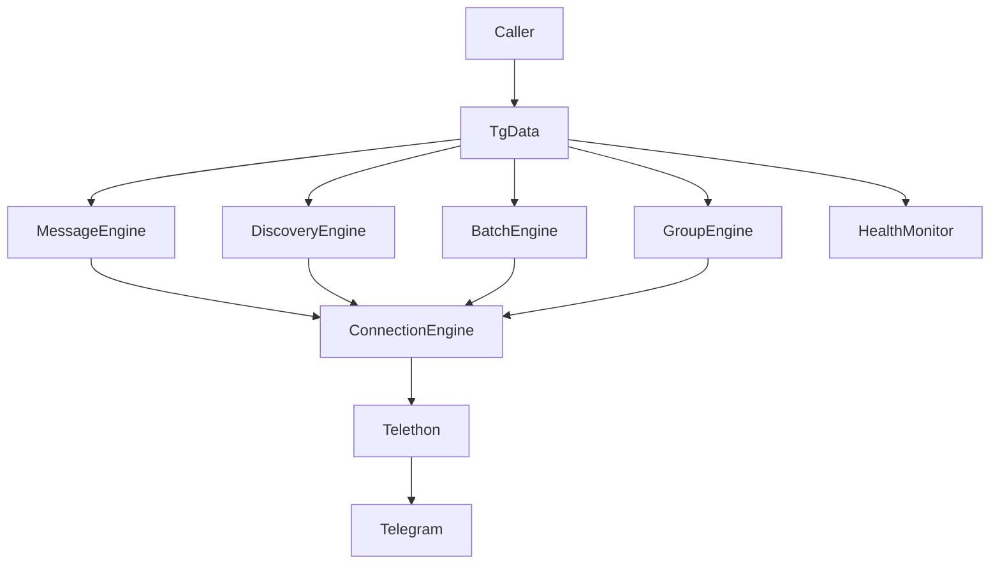

# Architecture introduction — tgdata

Source state:35aead1, refreshed2026-10-06. The production package has18 Python
modules and6,798 lines at this revision. This introduction follows their current
implementation, including the two soundness defects on the unmerged #7 branch.

## Entry points and ownership

`TgData` is the public facade. It holds the current legacy group, constructs a
ConnectionEngine, MessageEngine, DiscoveryEngine, BatchEngine and GroupEngine,
and owns a HealthMonitor. Polling and real-time registration also live here.
Stateless export/filter/statistics functions sit in utils.py, and progress.py
contains progress tracking. There is no service process or HTTP layer.

ConnectionEngine is the client factory and lifecycle owner. Persistent session()
work and pooling reuse standing clients; ephemeral_client() creates, connects,
checks authorization and disconnects one client. Group operations use the latter
without changing current_group. Config, proxy, device identity, stored sessions
and budgets enter through _new_client, so new paths should not construct an
independent transport.

The factory composes answer observation, join admission, read admission and the
per-call flood-threshold correction ahead of the real Telethon client. These
mixins are at different levels: public __call__ observes answers/thresholds,
while _call wraps the sender inside Telethon's retry loop for admission.

## Message and group flows

Legacy message methods resolve a target and ask MessageEngine to iterate Telegram
messages. MessageData converts each record to the DataFrame column conventions.
Callbacks can receive chunks; helpers then filter/export/analyze returned tables.
MessageEngine also owns count/search and media operations. Some older resolution
paths retry after synchronizing dialogs; they remain distinct from the new strict
known-cache group lookup contract.

BatchEngine uses the same configured client and read guard but produces a separate
MessageBatch value. message_batch.py defines canonical versioned records, JSON,
cursors and hashes. batch_files.py owns local media reads/writes/publication,
checks content hashes and preserves primary failures during cleanup. Partial
completed records travel on the original exception to support caller-owned replay.

DiscoveryEngine collects group candidates from recommendations, discussion links
and message links. It can spend the read allowance when inspecting posts, but
metadata-only requests and discovering a candidate do not join it.

GroupEngine is the new branch's operation layer. Its parser distinguishes handles,
known numeric peers and Telegram invite links, with token-free diagnostic labels.
Lookup projects metadata and membership; access performs a bounded history probe;
join preflights and sends one admitted mutation operation, allowing SDK retries.
Portable result classes keep missing IDs and incomplete outcomes explicit. A join
acknowledgment does not depend on subsequent network enrichment; optional local
cache/projection failures are contained.

## Persisted state and admission

Telethon owns the normal file session. With a session store, StoredSession keeps
an opaque value containing authentication, data-centre/update state, group/channel
entities and the account's own rows. It avoids persisting other message senders,
and it prevents one client from overwriting a login replacement it never loaded.
It is not an application message store.

ReadBudget and JoinBudget use separate versioned SQLite tables. Each is keyed by
fresh authenticated account ID, not session name. Short transactions admit work
before the sender is called; no database lock spans the network await. Successful
message reads settle unused capacity, while uncertain reads retain their bound.
Join attempts are never refunded merely because a response failed. Every supported
SDK retry needs admission again. Coordination covers processes sharing the file,
not independent hosts/files or unrelated Telegram clients.

## Health observation and the current gap

HealthMonitor uses ContextVar call scopes and task ownership to attribute events,
records condition state and recovers it on later answer evidence. The shared
client notes answered requests. A logger filter captures waits the SDK sleeps
through; callback recursion is suppressed without suppressing the nested events.
Health observes rather than enforcing account policy.

Current #7 code adds per-call account_id overrides and a group-recovery control.
This correctly labels fresh ephemeral events and prevents metadata from clearing
history denial. The aggregate ledger still has one per-instance set of fields,
and snapshot() gets its user ID from the cached primary client. The PR review
reproduces the resulting event/snapshot mismatch. The revision3 plan must carry
ownership through storage, recovery and summary selection rather than only print
it on events.

There is also a separate SDK error boundary to correct: Telethon defaults to a
generic ValueError after request retries are exhausted. The new numeric resolver
catches that type as a bad reference. The re-plan must preserve final RPC errors
and avoid inferring local origin solely from a broad exception class.

## Compatibility and tests

The code is packaged for Python3.7+ with a Telethon1.45.0 minimum below2.0; the
current executed environment is3.11.10/1.45.0. GroupInfo/DataFrame contracts and
MessageBatch's wire format are separate public interfaces. No global health
registry or worker implementation exists.

Suites12–20 exercise real SDK dispatch with supplied transports, real temporary
SQLite/files and controlled lifecycle hooks. Some older scripts require a live
account. The PR review's forced-overlap probe shows why gather plus immediately
completed futures is insufficient evidence of actual interleaving. Revision3
needs that scheduling condition in the product regression suite.
